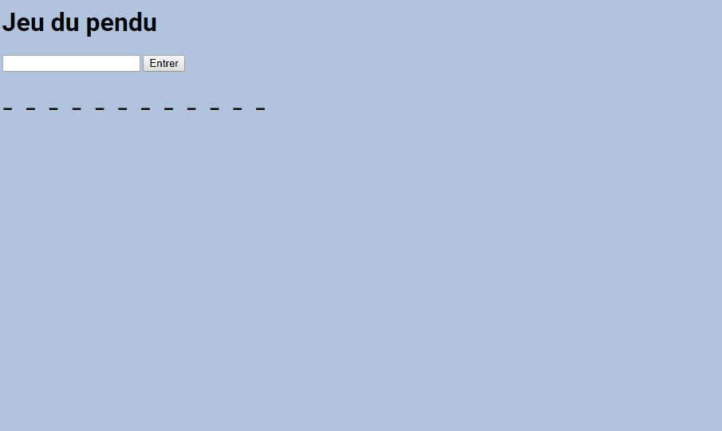

# pendu_js

# Jeu du pendu <!-- omit in toc -->

- Projet groupe par Romain, Robin, Florian, Mohamed
- Fork de <https://github.com/Fred-Vaniss/jeu-pendu>
- HTML, CSS et JavaScript

## Table des matières <!-- omit in toc -->

- [pendu_js](#pendu_js)
  - [Le simple exercice](#le-simple-exercice)
  - [Plus loin que ce qui avait été demandé](#plus-loin-que-ce-qui-avait-été-demandé)
  - [L'approfondissement de l'exercice](#lapprofondissement-de-lexercice)
    - [Le bonhomme](#le-bonhomme)
    - [Des mots complexes](#des-mots-complexes)
    - [Un dictionnaire géant](#un-dictionnaire-géant)
    - [Encore plus de fonctionalités](#encore-plus-de-fonctionalités)
    - [Un bonhomme expressif](#un-bonhomme-expressif)
    - [Un clavier virtuel](#un-clavier-virtuel)
    - [Un site responsive](#un-site-responsive)
    - [Des aniations et des indicateurs sur le clavier](#des-aniations-et-des-indicateurs-sur-le-clavier)
  - [Conclusion](#conclusion)

## Le simple exercice

C'était à la base juste un petit exercice ou il fallait juste faire un `prompt` pour demander à la personne de choisir une lettre et d'afficher à la console les lettres devinés avec un nombre d'essais limités.

## Plus loin que ce qui avait été demandé

J'ai commencé par aller plus loin en utilisant la page HTML pour entrer une lettre et afficher les lettres devinés sur cette même page. (on n'avais pas encore évoqué le DOM au cours)

Puis j'ai encore été plus loin en indiquant les lettres qu'on n'a pas trouvées en rouge.

Pour finir, j'ai fais une petite liste de mots dans un tableau qui sera choisi aléatoirement en début de partie. Il ne contenait qu'une petite dizaine de mots.

## L'approfondissement de l'exercice

Cet exercice est resté en suspens du 21 mai au 12 juin, on a eu beaucoup d'autres exercices entre temps. Comme j'avais terminés les autres exercices, j'ai décidé de revenir sur ce jeu du pendu pour apporter encore plus de fonctionalités.

### Le bonhomme

J'ai d'abord ajouté un bonhomme qui remplace l'indicateur d'essais classique. C'est un SVG que j'ai dessiné moi-même sur Illustrator et que j'affiche les éléments au fur et à mesure qu'on rate des essais.

Il a été dessinné sur Adobe Illustrator, j'ai ensuite généré un code SVG qui va me servir pour la page, j'ai ajouté les classes pour gérer l'affichage des membres individuels et j'ai codé le reste en JavaScript

### Des mots complexes

Ensuite, j'ai fais en sorte que mon jeu puisse gérer les espace, traits d'union, apostrophe et qu'il accepte les lettres à accens malgré qu'on aie tapé une lettre normale

*Entrer la lettre "e" acceptera également les letrres "é", "è" et "ê" par exemple*

### Un dictionnaire géant

En cherchant sur internet, j'ai trouvé un [site de générateur de mots aléatoire](http://www.textfixerfr.com/outils/generateur-de-mots-aleatoires.php) qui contiens un tableau avec plus de 2700 mots dans son fichier JavaScript, j'ai repris cette ligne de code et collé dans mon script. Mais vu la taille du tableau, mon script (ainsi que Visual Studio Code) présentait des difficultés.

J'ai donc appliqué ce que j'ai vu sur l'AJAX: j'ai mis toute la liste dans un fichier JSON séparé et fait une requête `XMLHttpRequest` pour le charger.

Désormais, mon jeu à plus de 2700 mots sélectionné aléatoirement.

### Encore plus de fonctionalités

Un de mes collègues m'a suggéré d'afficher les lettres tapés, je l'ai donc appliqué et je me suis aussi amusé à ajouter un menu caché qui peut être affiché après avoir tapé un *code de triche* avec les touches flèchées

### Un bonhomme expressif

Je me suis amusé à rajouter des détails à mon bonhomme en lui ajoutant des expression au fur et à mesure qu'on se trompe.

### Un clavier virtuel

Devoir sélectionner le champ de texte et de taper la lettre puis la touche entrer peut être pénible et redondant.

J'ai donc amélioré cela en y ajoutant un clavier virtuel où on pourra pliquer dessus pour entrer ses lettres, j'ai aussi fait en sorte qu'on puissse aussi entrer ses lettres d'un simple pression de touche sur son clavier.

### Un site responsive

J'ai fait en sorte que le jeu soit présentable sur mobile, que tous les éléments soient visible et utilisable sans difficulté.

### Des aniations et des indicateurs sur le clavier

Pour rendre le tout un peu plus dynamique, j'ai aussi apporter des petites animation sur les lettres à afficher ainsi qu'au clavier.

Ce fut une tâche qui était plus compliqué que prévu étant donné que j'ai du ré-écrire une bonne partie sur la façon d'afficher les lettres sur ma page. J'en ai également profité pour faire en sorte que ça gère les retours à la ligne de manière plus correcte.

## Conclusion

C'est un projet que j'ai adoré faire, je m'y conaissais déjà en Javascript mais malgré tout cette formation m'a permis d'en apprendre plus, ce projet m'a permis de mettre tout ce que j'ai appris en pratique et beaucoup de personnes l'ont adorés.

